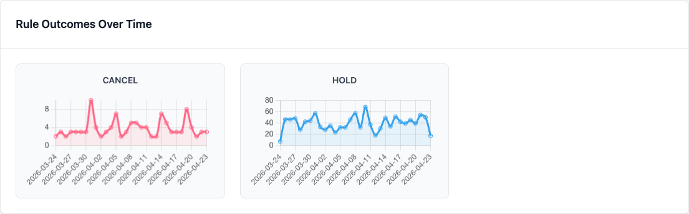
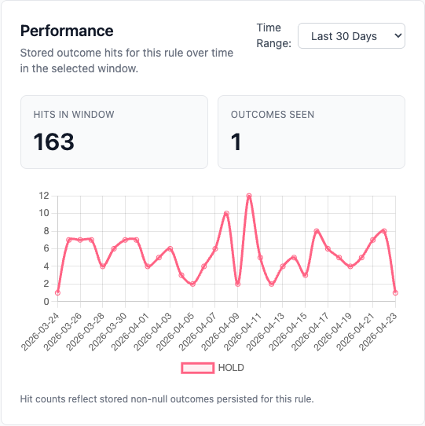
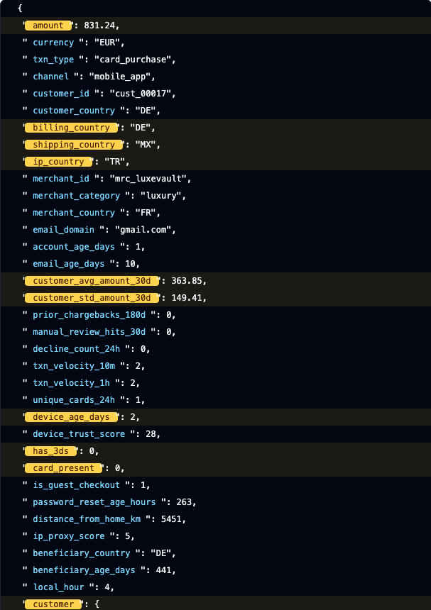
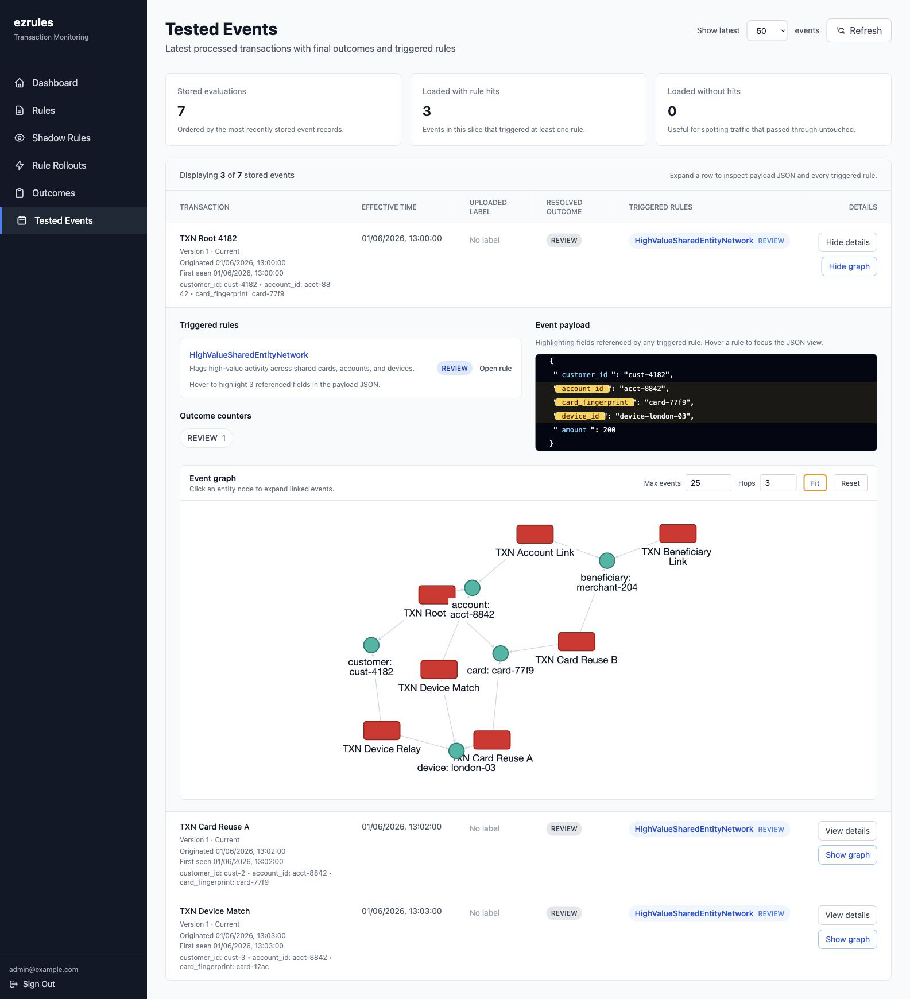
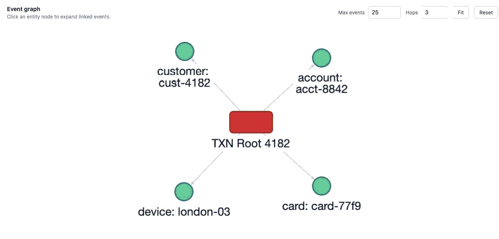
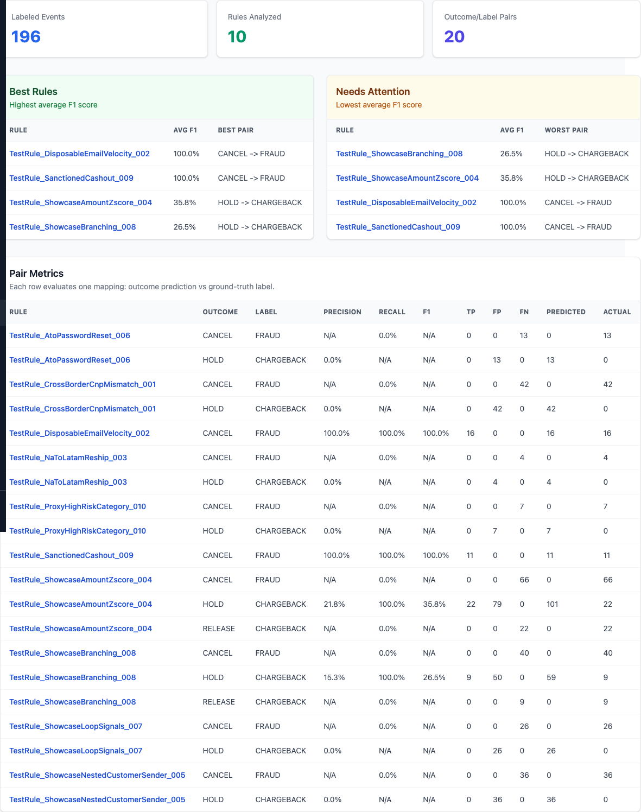
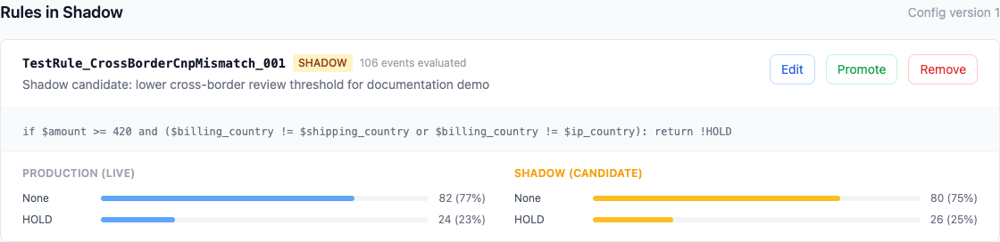
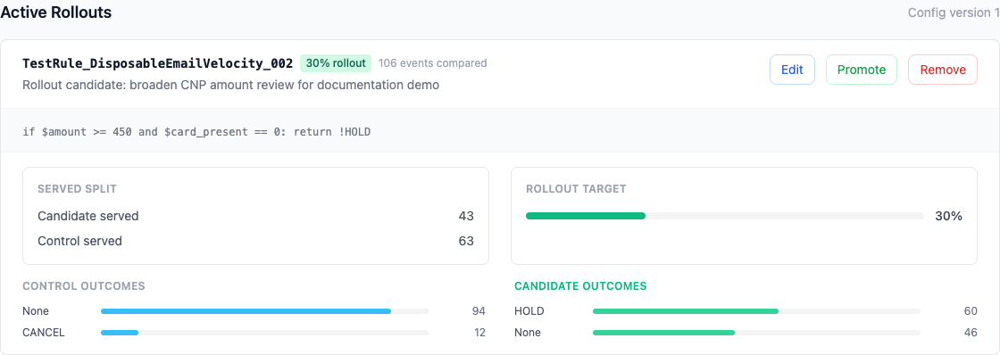

# ezrules

**[Website & live demo](https://ezrules.io)** · **[Documentation](https://ezrules.readthedocs.io/)** · **[Blog](https://ezrules.io/blog/)**

Open-source transaction monitoring for teams that need clear rule control, auditability, and fast operational changes.

ezrules gives fraud, risk, and compliance administrators a web workspace for managing decision rules without turning every policy update into an engineering project. Rules can be drafted, tested, reviewed, promoted, paused, rolled out, and audited from one place, while your systems keep sending events to a simple evaluation API.


## Why Teams Use It

- **Own the rule lifecycle.** Create rules, keep drafts separate from live logic, pause risky rules, restore older revisions, and promote changes deliberately.
- **See what happened.** Review canonical served decisions, the outcome returned, every rule that fired, and the exact event version those rules used.
- **Work the exceptions.** Turn non-neutral decisions into resolvable cases, track rescoring changes, and publish case/evaluation events to external systems.
- **See queue health at a glance.** Use Operations to track active and unassigned work, resolution flow, false-positive rate, aging cases, and the rules creating the most review work.
- **React to outcome spikes.** See new alert incidents in the live notification badge and open the affected cases directly from a bounded, scrollable inbox.
- **Improve rules with evidence.** Use labels, precision/recall reports, backtests, shadow rules, and percentage rollouts before changing production decisions.
- **Use reproducible historical features.** Computed counts, distinct values, sums, averages, extrema, standard deviation, and days-since features follow documented point-in-time, correction, null, and type semantics.
- **Run with admin controls.** Manage roles, permissions, API keys, outcomes, user lists, field types, traffic persistence, and audit history inside the product.
- **Self-host it.** Run the full stack yourself with PostgreSQL, Redis, FastAPI, Celery, and the web UI.

## Demo

The demo stack starts with sample rules, outcomes, labels, and evaluated events.

```bash
git clone https://github.com/sofeikov/ezrules.git
cd ezrules
docker compose -f docker-compose.demo.yml up --build
```

Then open:

| Service | URL |
|---|---|
| Web UI | http://localhost:4200 |
| API | http://localhost:8888 |
| Mail UI | http://localhost:8025 |

Login with `admin@example.com` / `admin`.

To stop and remove the demo data:

```bash
docker compose -f docker-compose.demo.yml down -v
```

### Trace A Decision Field By Field


## Product Tour

### Manage Live Rules

Create and maintain the rule set from a reviewable UI. Active rules, drafts, ordering, lifecycle actions, and rule status are visible in one place.


### Monitor 30-Day Activity

Switch the dashboard to the 30-day window to review sustained traffic and outcome patterns instead of a single point-in-time snapshot.



### Run Case Operations

Open **Operations** for a bounded 7-, 30-, or 90-day view of the case queue. It combines current active and unassigned totals with daily opened/resolved flow, a false-positive rate based on dispositioned cases, the ten highest-priority aging cases, and the five rules that opened the most cases. Use **Open Cases** when the summary shows work that needs action.

### Inspect Rule Logic And Performance

Each rule has its own detail view with source logic, test payloads, historical revisions, backtesting, hit/outcome performance, and recent transactions that triggered the rule.



### Review Tested Events

The Tested Events view connects decisions back to the raw payload, triggered rules, labels, resolved outcomes, and nearby entity relationships. Referenced fields are highlighted so an admin can see why a rule fired, while the event graph shows related traffic through shared users, cards, devices, merchants, and other configured entities.





### Expand Event Relationships

Click an entity node in the graph to expand nearby transactions that share that customer, account, card, device, merchant, or another configured entity.



### Measure Rule Quality

When events are labeled, ezrules can compare outcomes to ground truth and rank rules by precision, recall, F1, true positives, false positives, and false negatives.



### Validate Candidate Changes Safely

Use shadow mode when you want observe-only comparison, and use rollouts when a candidate rule should serve a controlled share of live traffic.





## How It Fits Into Your System

Your application sends an event to ezrules, and ezrules returns the resolved outcome.

```bash
curl -X POST http://localhost:8888/api/v2/evaluate \
  -H "Content-Type: application/json" \
  -H "X-API-Key: <api-key>" \
  -d '{
    "transaction_id": "txn_123",
    "effective_at": "2026-04-23T12:00:00Z",
    "event_data": {
      "amount": 875.50,
      "currency": "EUR",
      "customer_country": "US",
      "shipping_country": "MX",
      "has_3ds": 0
    }
  }'
```

The result is stored for review in the UI, including the winning outcome and the rules that contributed to the decision.
Non-neutral decisions can also become case work items, while evaluation and case lifecycle events are available through the integration event stream.

## Core Workflows

- **Rule authoring:** write rule logic with validation, observed field references, configured outcomes, and list references.
- **Event testing:** dry-run JSON events against the active rule set without storing them in Tested Events or analytics.
- **Shadow deployment:** observe what a rule would do on live traffic without changing production outcomes.
- **Rule rollouts:** send a stable percentage of traffic through a candidate rule before full promotion.
- **Backtesting:** compare proposed logic against historical events before release.
- **Graph investigation:** inspect connected events through configured entity links and use graph-derived stats inside rule logic.
- **Labeling and quality reports:** upload or assign labels, then measure how rules perform against known outcomes.
- **Audit and access control:** keep change history and separate admin, editor, and read-only responsibilities.

## Documentation

- [Quickstart](docs/getting-started/quickstart.md)
- [Installation](docs/getting-started/installation.md)
- [Configuration](docs/getting-started/configuration.md)
- [Admin guide](docs/user-guide/admin-guide.md)
- [Rule authoring](docs/user-guide/creating-rules.md)
- [Performance testing](docs/user-guide/performance-testing.md)
- [API reference](docs/api-reference/manager-api.md)
- [Deployment guide](docs/architecture/deployment.md)
- [What's new](docs/whatsnew.md)

The documentation site is also available at [ezrules.readthedocs.io](https://ezrules.readthedocs.io/). Product articles and walkthroughs live on the [ezrules blog](https://ezrules.io/blog/).

## Development

For contributors, the project uses Python 3.12, `uv`, FastAPI, SQLAlchemy, Celery, PostgreSQL, Angular, Tailwind CSS, and Playwright.

```bash
uv sync
uv run poe check
```

Frontend dependencies live in `ezrules/frontend/`.

```bash
cd ezrules/frontend
npm install
npm start
```

See [docs/contributing.md](docs/contributing.md) for contribution guidance.

## License

Apache License 2.0. See [LICENSE](LICENSE).
