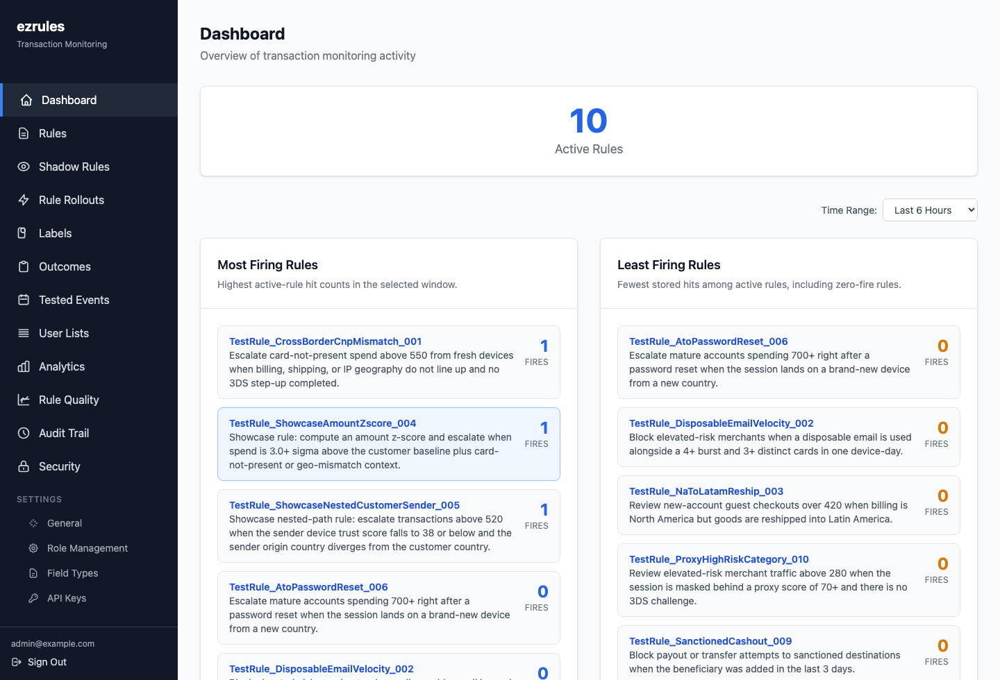
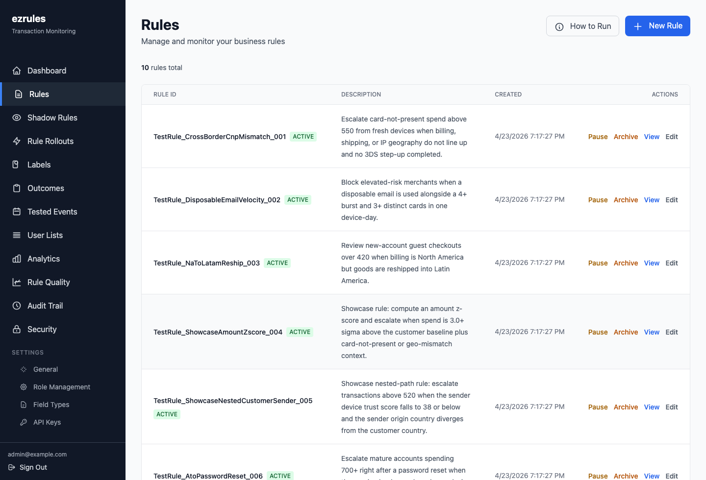
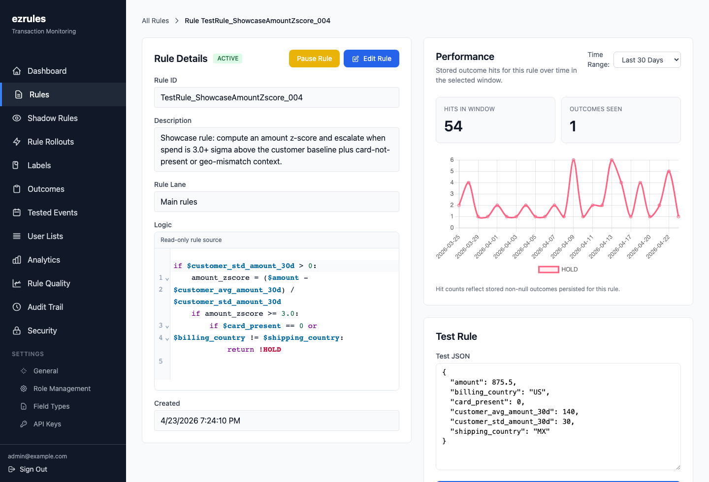
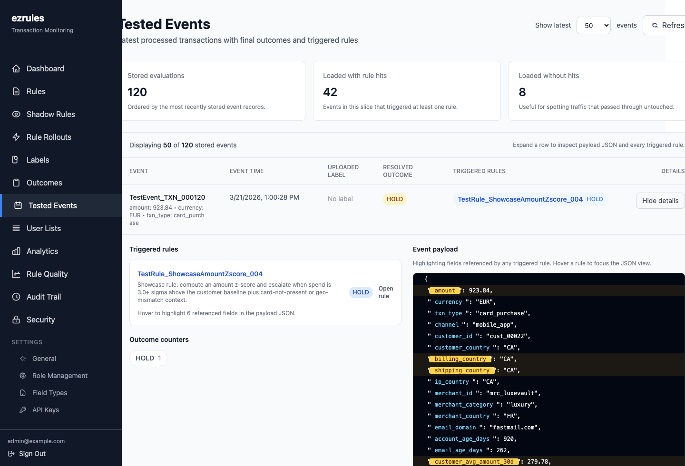
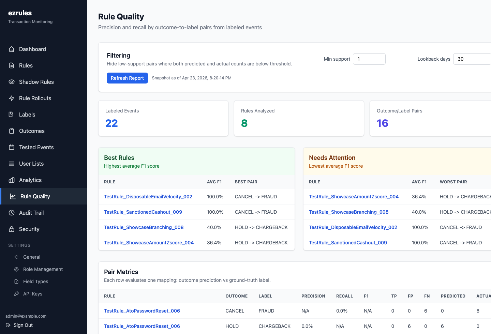

# ezrules

Open-source transaction monitoring for teams that need clear rule control, auditability, and fast operational changes.

ezrules gives fraud, risk, and compliance administrators a web workspace for managing decision rules without turning every policy update into an engineering project. Rules can be drafted, tested, reviewed, promoted, paused, rolled out, and audited from one place, while your systems keep sending events to a simple evaluation API.



## Why Teams Use It

- **Own the rule lifecycle.** Create rules, keep drafts separate from live logic, pause risky rules, restore older revisions, and promote changes deliberately.
- **See what happened.** Review evaluated events, the outcome returned, every rule that fired, and the exact event fields those rules used.
- **Improve rules with evidence.** Use labels, precision/recall reports, backtests, shadow rules, and percentage rollouts before changing production decisions.
- **Run with admin controls.** Manage roles, permissions, API keys, outcomes, user lists, field types, strict mode, and audit history inside the product.
- **Self-host it.** Run the full stack yourself with PostgreSQL, Redis, FastAPI, Celery, and the web UI.

## Demo

The demo stack starts with sample rules, outcomes, labels, and evaluated events.

```bash
git clone https://github.com/sofeikov/ezrules.git
cd ezrules
docker compose -f docker-compose.demo.yml up --build
```

Then open:

| Service | URL |
|---|---|
| Web UI | http://localhost:4200 |
| API | http://localhost:8888 |
| Mail UI | http://localhost:8025 |

Login with `admin@example.com` / `admin`.

To stop and remove the demo data:

```bash
docker compose -f docker-compose.demo.yml down -v
```

### Trace A Decision Field By Field


## Product Tour

### Manage Live Rules

Create and maintain the rule set from a reviewable UI. Active rules, drafts, ordering, lifecycle actions, and rule status are visible in one place.



### Inspect Rule Logic And Performance

Each rule has its own detail view with source logic, test payloads, historical revisions, backtesting, and hit/outcome performance.



### Review Tested Events

The Tested Events view connects decisions back to the raw payload, triggered rules, labels, and resolved outcomes. Referenced fields are highlighted so an admin can see why a rule fired.



### Measure Rule Quality

When events are labeled, ezrules can compare outcomes to ground truth and rank rules by precision, recall, F1, true positives, false positives, and false negatives.



## How It Fits Into Your System

Your application sends an event to ezrules, and ezrules returns the resolved outcome.

```bash
curl -X POST http://localhost:8888/api/v2/evaluate \
  -H "Content-Type: application/json" \
  -H "X-API-Key: <api-key>" \
  -d '{
    "event_id": "txn_123",
    "event_timestamp": "2026-04-23T12:00:00Z",
    "event_data": {
      "amount": 875.50,
      "currency": "EUR",
      "customer_country": "US",
      "shipping_country": "MX",
      "has_3ds": 0
    }
  }'
```

The result is stored for review in the UI, including the winning outcome and the rules that contributed to the decision.

## Core Workflows

- **Rule authoring:** write rule logic with validation, observed field references, configured outcomes, and list references.
- **Shadow deployment:** observe what a rule would do on live traffic without changing production outcomes.
- **Rule rollouts:** send a stable percentage of traffic through a candidate rule before full promotion.
- **Backtesting:** compare proposed logic against historical events before release.
- **Labeling and quality reports:** upload or assign labels, then measure how rules perform against known outcomes.
- **Audit and access control:** keep change history and separate admin, editor, and read-only responsibilities.

## Documentation

- [Quickstart](docs/getting-started/quickstart.md)
- [Installation](docs/getting-started/installation.md)
- [Configuration](docs/getting-started/configuration.md)
- [Admin guide](docs/user-guide/admin-guide.md)
- [Rule authoring](docs/user-guide/creating-rules.md)
- [API reference](docs/api-reference/manager-api.md)
- [Deployment guide](docs/architecture/deployment.md)
- [What's new](docs/whatsnew.md)

The documentation site is also available at [ezrules.readthedocs.io](https://ezrules.readthedocs.io/).

## Development

For contributors, the project uses Python 3.12, `uv`, FastAPI, SQLAlchemy, Celery, PostgreSQL, Angular, Tailwind CSS, and Playwright.

```bash
uv sync
uv run poe check
```

Frontend dependencies live in `ezrules/frontend/`.

```bash
cd ezrules/frontend
npm install
npm start
```

See [docs/contributing.md](docs/contributing.md) for contribution guidance.

## License

Apache License 2.0. See [LICENSE](LICENSE).
