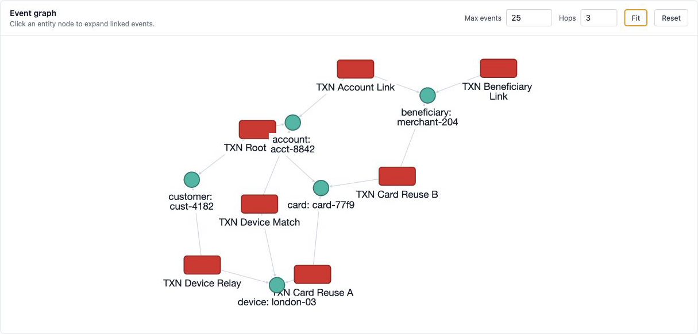

# Graph-Based Event Investigation in ezrules

Fraud investigations rarely stop at one transaction.

A single event can look suspicious because of its own fields: high amount, fresh device, risky merchant category, unusual geography, or a burst of recent declines. But many of the most useful signals are relational:

- the same card appearing across several users
- a device reused by unrelated accounts
- a merchant cluster tied to repeated chargebacks
- an email domain connecting a burst of new accounts
- a customer identity touching many payment instruments

Those relationships are hard to see when every event is inspected as an isolated JSON payload. ezrules now supports graph-backed investigation from Tested Events and graph-derived rule features for production evaluation.



## What the graph represents

The graph is built from configured entity fields. Each stored event is linked to entity values extracted from its payload, such as:

- `customer_id`
- `customer.id`
- `sender.id`
- `merchant_id`
- `email_domain`
- `card_fingerprint`
- `device_id`

When two events share the same configured entity value, they become connected through that entity. The graph view renders this as event nodes connected to entity nodes.

This means an analyst can start from one served decision and immediately see nearby traffic connected through shared operational identities.

## Why this is useful during review

Without a graph, an analyst reviewing one event has to manually search for related activity. They might copy a card fingerprint, filter historical events, inspect another transaction, copy a device id, and repeat the process.

The event graph makes the first pass faster:

- open a Tested Events row
- click **Show graph**
- inspect related events up to the configured event and hop limits
- click entity nodes to expand additional nearby relationships

The graph is intentionally bounded. By default it opens with nearby relationships up to three event-to-event hops, and the max event limit prevents broad clusters from overwhelming the browser.

## How rule execution uses graph data

The investigation graph is not only a visual aid. The same stored event-to-entity links support graph-derived computed stats in rule logic.

For example:

```python
if stat[user.unique_cards_graph_90d] >= 2:
    return !HOLD
```

At evaluation time, ezrules resolves `stat[...]` before executing the rule. A graph feature starts from an entity in the current event, traverses historical event-to-entity links within the configured time window and depth, and returns a bounded aggregate such as a distinct count of target entities.

That makes relationship-aware rules possible without embedding graph traversal logic in every rule.

## Keeping graph features bounded

Graph traversal can grow quickly in production traffic, so graph features include guardrails:

- allowed time windows
- allowed entity types
- max traversal depth
- max expanded node count
- active-feature lifecycle controls
- statement timeout protection

The goal is to support useful connected-event signals while keeping rule execution predictable.

## A practical fraud example

Consider an event where `customer_id = cust_00013`.

In isolation, the payload might show:

- a card-not-present checkout
- a risky merchant category
- a disposable email domain
- elevated velocity

The graph can show that the same customer, email domain, merchant category, or other configured entity also appears in nearby events. That gives the reviewer immediate context: this may be part of a broader cluster rather than a one-off transaction.

For rules, a graph feature can turn that cluster context into a policy signal. Instead of only checking this event's fields, a rule can ask whether the current user has connected to too many cards, devices, or merchants in the configured window.

## When to use graph investigation

Graph investigation is especially useful for:

- card testing bursts
- synthetic identity clusters
- account takeover patterns
- mule-account networks
- merchant abuse
- repeated disposable-email activity

It is less useful for events that are genuinely isolated or for rules where the decision depends only on event-local fields.

## What to configure carefully

The quality of graph results depends on the configured entity fields.

If an entity field is not configured, ezrules will not materialize links for it. If historical events were stored before a field was configured, those older events need link backfill before they appear in graph traversal.

Useful graph fields are stable identifiers with operational meaning. Avoid low-cardinality fields that connect too much traffic, such as country or currency, unless the feature is deliberately designed around broad groups.

Good candidates include:

- customer ids
- account ids
- device ids
- card fingerprints
- merchant ids
- email domains
- beneficiary ids

The graph should reveal meaningful relationships, not turn every event into the same giant component.
