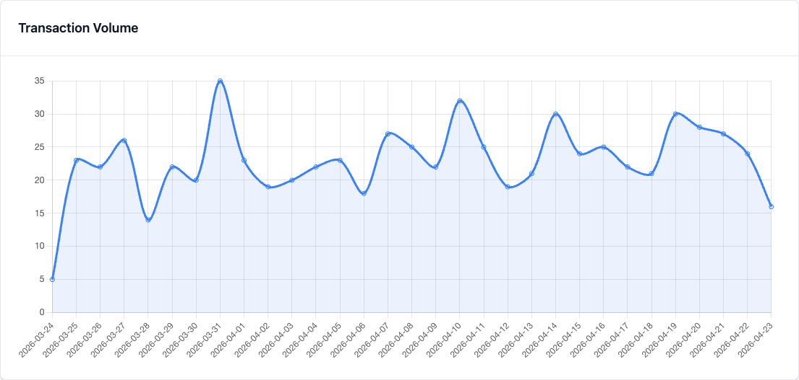

# Blog

Short practical writeups on using ezrules in real workflows.

## Posts

- [From Zero to Live Rule Evaluation in 10 Minutes with ezrules](zero-to-live-rule-evaluation.md)
- [Rule Lifecycle Management in ezrules: Draft, Promote, Archive with Audit Trail](rule-lifecycle-management.md)
- [Automatic Field Type Management](field-type-management.md)
- [Why Complex Entities Matter in a Fraud Rules Engine](complex-entities-in-fraud-rules.md)
- [Shipping Rule Changes with Less Guesswork: Shadow Deployment in ezrules](shadow-deployment.md)
- [Rule Quality in ezrules: Precision and Recall by Outcome-Label Pair](rule-quality-precision-recall.md)
- [Ordered Rule Execution in ezrules: When First Match Beats Conflict Resolution](rule-ordering-first-match.md)
- [AI-Assisted Rule Authoring in ezrules: Generate Transaction Monitoring Rules from Natural Language](ai-rule-authoring.md)
