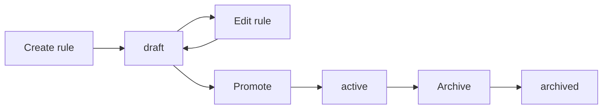

# Rule Lifecycle Management in ezrules: Draft, Promote, Archive with Audit Trail

Rule engines usually fail at one of two extremes:

- Every edit is live immediately, which is fast but risky.
- Every edit requires an external process, which is safe but slow.

ezrules now supports an explicit lifecycle so teams can move fast without losing control: `draft` -> `active` -> `archived`, with promotion approvals captured in the audit trail.

## Why lifecycle controls matter

If a rule change can go live directly from an edit, then you can accidentally ship unreviewed logic. If a rule change requires manual coordination outside the system, then iteration slows down and people work around process.

The useful middle ground is to separate:

- rule authoring (`draft`)
- rule deployment (`active`)
- retirement (`archived`)

This gives you cleaner change control and a clear operational state for every rule.

## What is now stored per rule

Each rule now includes lifecycle metadata:

- `status`: `draft`, `active`, or `archived`
- `effective_from`: when the active version became effective
- `approved_by`: user id who approved promotion
- `approved_at`: when promotion was approved

The same metadata is snapshotted into `rules_history`, so lifecycle transitions and approver chain context are preserved in historical revisions.

## API behavior by lifecycle

The lifecycle is enforced by API behavior:

- `POST /api/v2/rules` creates a `draft` rule
- `PUT /api/v2/rules/{id}` saves edits as `draft` and clears previous approval metadata
- `POST /api/v2/rules/{id}/promote` moves `draft` to `active` and records approver + approval timestamp
- `POST /api/v2/rules/{id}/archive` moves a rule to `archived`
- `DELETE /api/v2/rules/{id}` deletes the rule (requires `DELETE_RULE`)

Production evaluation config now includes only `active` rules.



## Promotion is a first-class approval step

Promotion is no longer an implicit side effect of editing. It is an explicit operation that records:

- who approved
- when it was approved
- when it became effective

That gives you a defensible trail for internal governance and external audits, while keeping authoring fast for rule editors.

## Archive is not delete

Archiving is useful when you need to retire a rule but keep full context.

- `archived` rules are no longer active in production config
- historical versions and metadata remain available
- teams can distinguish "no longer used" from "removed forever"

Use delete when you intentionally want permanent removal. Use archive when you want operational retirement with history intact.

## Example: promote and archive

```bash
# Promote draft rule 42
curl -X POST http://localhost:8888/api/v2/rules/42/promote \
  -H "Authorization: Bearer <access_token>"

# Archive rule 42
curl -X POST http://localhost:8888/api/v2/rules/42/archive \
  -H "Authorization: Bearer <access_token>"
```

## How this fits with shadow deployment

Lifecycle and shadow solve different concerns:

- Lifecycle controls whether a rule is draft, active, or archived in production management flow.
- Shadow deployment validates candidate behavior on live traffic before promotion.

A practical sequence is:

1. Edit rule in draft
2. (Optional) deploy to shadow for live validation
3. Promote when approved
4. Archive when rule is retired

## Net effect

You get a cleaner rule lifecycle without adding operational friction:

- safer releases through explicit promotion
- auditable approval chain
- clear operational state in UI and API
- predictable retirement path through archive

---

Related docs:

- [Manager API](../api-reference/manager-api.md)
- [Creating Rules](../user-guide/creating-rules.md)
- [Shadow Deployment guide](../user-guide/shadow-deployment.md)
