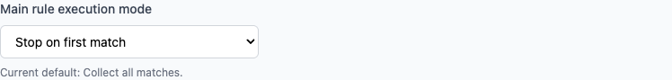
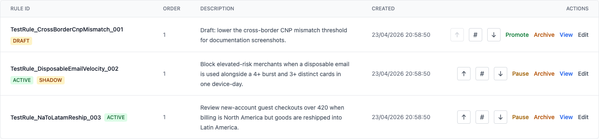

# Ordered Rule Execution in ezrules: When First Match Beats Conflict Resolution

Most rule engines start with one simple idea: run every active rule, collect every outcome, and then resolve conflicts at the end.

That works well when:

- you want broad signal collection
- multiple rules are allowed to fire on the same event
- the final decision should come from a severity hierarchy

It starts to break down when the business intent is really procedural:

- run the strongest allow or deny rule first
- stop once you already know the answer
- make the ordering itself part of the policy

ezrules now supports that second model for the main rule lane through ordered execution and a `first_match` mode.

## When ordered execution is useful

Ordered execution is useful when the rule set is really a sequence, not a bag of independent checks.

Common cases:

- **Progressive screening**: early rules handle obvious or high-confidence cases, and later rules are fallback checks.
- **Short-circuit decisions**: once one rule returns the intended outcome, running more rules only adds noise.
- **Policy precedence**: some rules should win because they represent stricter or more authoritative business intent.
- **Operational clarity**: analysts need to know not just which rules exist, but which one gets first shot.

In those cases, "run everything and resolve later" can be misleading. The severity hierarchy still gives you a winner, but it does not reflect the procedural order people actually intended.

## What ezrules now supports

For the **main** rule lane, ezrules supports two execution modes:

- `all_matches`
- `first_match`

`all_matches` is the legacy behavior:

- every active main rule is evaluated
- all non-null outcomes are collected
- the platform resolves the stored `resolved_outcome` from the configured outcome hierarchy

`first_match` changes that:

- active main rules are evaluated in explicit order
- evaluation stops at the first main rule that returns an outcome
- only that matching rule is persisted for the served result

The allowlist lane still keeps its own behavior:

- allowlist runs before the main lane
- if an allowlist rule matches, the main lane is skipped
- allowlist is still governed by the configured neutral outcome

So the feature is specifically about how the **main** rule lane behaves once allowlist did not short-circuit the request.

## How operators use it

The operator flow is now:

1. Go to **Settings -> General**
2. Set **Main rule execution mode** to **Stop on first match**
3. Go to **Rules**
4. Click **Reorder Rules**
5. Use:
   - `↑` to move a rule earlier
   - `↓` to move a rule later
   - `#` to jump a rule to an exact position
6. Click **Save Order**

When first-match mode is not enabled, the ordering UI is intentionally hidden:

- no `Order` column
- no `Reorder Rules` button
- no inline position controls

That is deliberate. The product only shows ordering controls when ordering actually changes live execution semantics.

## Why the controls live on the Rules page

The first implementation exposed an exact numeric order on individual rule edit screens. That turned out to be the wrong mental model.

Ordering is not really a property of one rule in isolation. It is a property of the whole main rule set.

To make that clearer, ezrules now groups rule-order controls in one place:

- the **Rules** list page shows the visible sequence
- button-based reordering and exact-position entry both live there
- create and edit screens no longer ask authors to manage absolute position numbers in isolation

That keeps the UI closer to the actual question operators are answering:

> "Where should this rule sit relative to the other main rules?"

## How ezrules implements it

At the data model level, each rule stores:

- `evaluation_lane`
- `execution_order`
- `status`

Only non-archived main rules participate in the reorder workflow.

When the platform rebuilds the production rule config for the main lane, it sorts by:

1. `execution_order`
2. `r_id` as a deterministic tie-breaker

The runtime setting `main_rule_execution_mode` controls whether the evaluator:

- runs the full ordered list and collects all matches, or
- stops on the first matching main rule

That same execution mode is also snapshotted into the shadow-evaluation queue payload so replay stays consistent with the semantics that were active when the event was actually served.

## What gets audited

Reordering is not just a UI shuffle. It is recorded.

ezrules now includes:

- a dedicated `reorder_rules` permission
- reorder actions stored in rule history with `action=\"reordered\"`
- `execution_order` included in the rule audit response

That matters because ordered execution changes live decision behavior. If order is a production control surface, it needs the same governance and traceability as promotion, pause, or rollback.

## What this does not change

This feature does **not** turn the whole platform into a single sequential pipeline.

It does not change:

- allowlist-first precedence
- outcome hierarchy semantics for `all_matches`
- backtesting into a full multi-rule sequential simulator

Backtesting in ezrules is still primarily rule-centric. Ordered serving is about the live main-lane evaluator path.

## Practical guidance

Use `all_matches` when:

- you want broad observability across the rule set
- you care about every triggered rule
- the severity hierarchy is the right final arbiter

Use `first_match` when:

- the rule set is intentionally procedural
- precedence matters more than aggregate conflict resolution
- later rules should only run if earlier rules did not already decide the case

If your team debates whether a rule should be "more severe" or "earlier", that is a sign you are choosing between two different policy models:

- **severity hierarchy** answers "which outcome wins if several rules fire?"
- **ordered execution** answers "which rule gets to decide first?"

ezrules now supports both models explicitly.

---

Related docs:

- [Manager API](../api-reference/manager-api.md)
- [Creating Rules](../user-guide/creating-rules.md)
- [Allowlist Rules](../user-guide/allowlist-rules.md)
- [Rule Lifecycle Management](rule-lifecycle-management.md)
