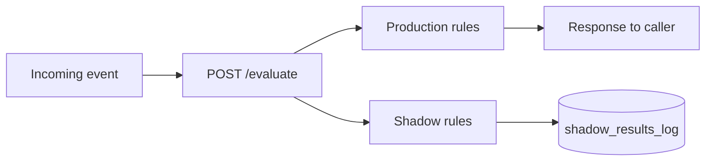
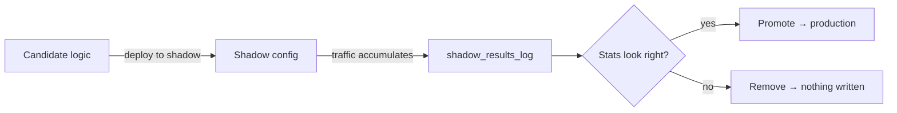

# Shipping Rule Changes with Less Guesswork: Shadow Deployment in ezrules

There's a gap between "this rule passes tests" and "this rule is safe to ship." Closing that gap is what shadow deployment is for.

## The problem with deploying rule changes

You write a new version of a rule. You test it with realistic payloads and the logic is correct. You backtest it against stored historical events and the numbers look acceptable. Then you ship it and find out fairly quickly that production traffic was different from what you expected — a field arriving as a string instead of an integer, a traffic spike at a time you didn't have good historical coverage for, a new upstream product generating a pattern your backtest window didn't include.

This is not primarily a testing problem. Backtesting is genuinely useful: it tells you how a rule would have performed on a defined historical window, which helps you calibrate thresholds and catch logic errors before they touch anything real. But a historical window is fixed. Your traffic today might differ from three months ago in ways that matter — seasonal patterns, data quality shifts from upstream systems, new transaction types entering the mix. A backtest from Q3 is a reasonable but imperfect proxy for Q1.

What you actually want to know is: how does this rule behave on current traffic, with current data, at current volumes?

## What shadow mode does

When you deploy a rule to shadow, it evaluates every incoming event alongside the production rule set. The same payload goes through both. Production results are returned to the caller as normal. Shadow results are stored in a separate table and never returned.

From the caller's perspective, nothing has changed. From your perspective, you're accumulating a real distribution of how the candidate rule would have answered every question the production system received, starting from the moment you deployed it.

There is no traffic splitting, no separate service to deploy, no routing configuration. You hit the Deploy to Shadow button (or the API equivalent), and from that point forward every event is evaluated against the shadow config in parallel with production.

## What the comparison tells you

The stats endpoint (`GET /api/v2/shadow/stats`) shows outcome distributions for each shadow rule alongside the production outcomes for the same events. If you're tightening a threshold — a rule that should fire more often than the current version — you expect more `HOLD` decisions in the shadow column than in the production column. If they're close, your change has less bite than you expected. If they diverge significantly, you know the magnitude before it matters.

This doesn't tell you whether the decisions would have been *correct*, only how different they are from current production behavior. Whether that difference is acceptable is a judgment call that depends on your situation. But you're making that call with data from today's traffic rather than from a historical window that may or may not be representative.

## The draft-logic path

One workflow that comes up often: you want to test a logic change in shadow without committing it to the rules table first. The deploy endpoint accepts optional logic and description fields. If you provide them, they're stored in the shadow config and the rules table stays unchanged.

If you decide the change is wrong after observing the shadow results, you remove it. Nothing was written to production. If it looks right, you promote: the rules table updates to the shadow logic, the production config updates, and the shadow entry is cleared in one atomic operation.

This matters for iteration speed. You can go through several candidate versions of a rule — deploy to shadow, watch the distribution, decide it's off, adjust, re-deploy — without any of those intermediate versions touching production. The only version that ever enters the production config is the one you decided to promote.

## Backtesting and shadow are complementary

Backtesting and shadow deployment answer different questions and the useful pattern is to use both.

Backtest before you have a candidate ready. It's good for initial calibration: does this threshold make sense on historical data, are there edge cases in the stored event set, is the logic handling the patterns it's supposed to handle? This is where you rule out obviously bad ideas.

Shadow after you have a candidate ready. It's good for validation on current traffic: is the production impact what I expected, are there patterns in live data that weren't well represented in the historical window? This is where you build confidence before promoting.

Neither tool tells you what the other does. Backtesting has no access to live traffic. Shadow has no access to historical events. A rule that passes both gives you substantially more confidence than one that only passed one.

## A few things shadow doesn't do

Shadow results aren't labeled. You can see how often the shadow rule returns each outcome and compare that to production for the same events, but you don't automatically know whether those shadow decisions would have been correct against ground truth. If you have labeled data covering the shadow period, you can cross-reference manually, but that's not built in.

Shadow evaluation is best-effort. If the shadow evaluation for an event fails — a missing field, a type error, anything that raises an exception — the error is silenced and that event isn't stored in the shadow results. The production evaluation is unaffected. This means the shadow results may have gaps, and if the rule has bugs that only surface on certain payload shapes, those events are undercounted rather than surfaced as errors. Worth checking result counts against total event volume if completeness matters to you.

Stats reset when you re-deploy the same rule to shadow. If you update the draft logic and push a new version, the existing results are cleared. You start accumulating again from zero. This is intentional — stale results from a previous candidate version aren't meaningful for evaluating the current one — but it's worth knowing if you're expecting continuous accumulation across logic changes.

## The net effect

Shadow deployment narrows the gap between "the backtest looked acceptable" and "I'm confident this is right." It doesn't eliminate judgment, but it moves the validation point from historical data to current traffic, which is where the rule will actually run.

---

Full docs: [Shadow Deployment guide](../user-guide/shadow-deployment.md)
